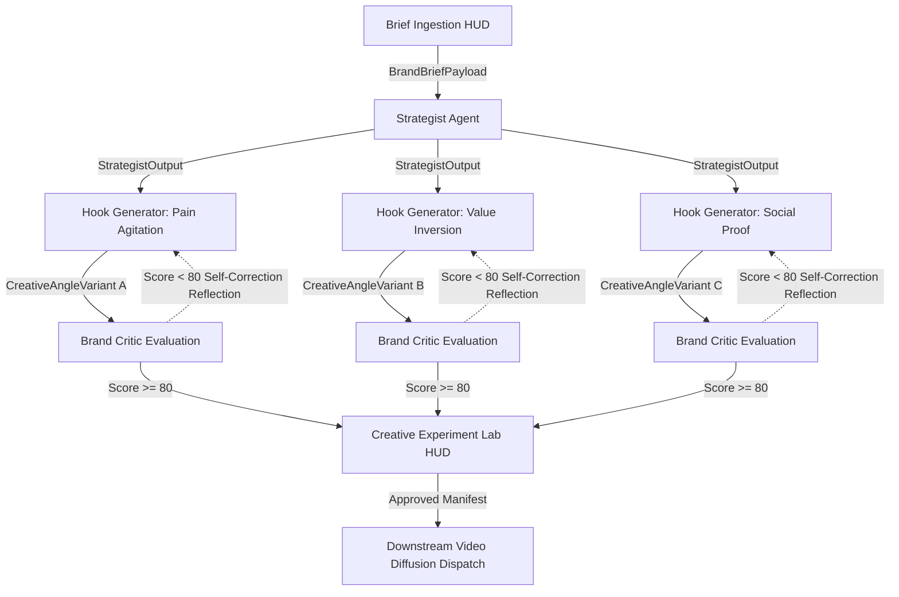

# Creative Intelligence OS

> An agentic, node-based workspace and algorithmic orchestration engine designed as the strategic command layer preceding generative media pipelines.

[](https://github.com/harishrobin11/Creative-Intelligence-OS.git)
[](https://github.com/harishrobin11/Creative-Intelligence-OS.git)
[](https://github.com/harishrobin11/Creative-Intelligence-OS.git)
[](https://github.com/harishrobin11/Creative-Intelligence-OS.git)
[](https://github.com/harishrobin11/Creative-Intelligence-OS.git)

---

## 1. Executive Abstract & Strategic Vision

Generative media engines across image synthesis, neural video generation, and dynamic speech modeling have commoditized asset rendering. Today, generating high-resolution video frames or synthetic avatars requires a single REST call. However, modern commercial creative agencies and digital performance marketing teams routinely encounter catastrophic failure not during media rendering, but in upstream creative strategy, multi-hypothesis ideation, and deterministic quality validation.

**Creative Intelligence OS** formulates creative advertising as an observable, directed acyclic graph (DAG). The system decomposes creative briefs into psychographic customer profiles, formulates parallel creative angles, synthesizes structured short-form video hooks, and subjects every asset to an automated brand reflection loop before synthesis dispatch.

### Core Paradigm Shift: Strategy-First Computational Graphs

- **Traditional Generative Tools**: Brief → Monolithic Chat Prompt → Black-Box Generation → Discard → Retry.
- **Creative Intelligence OS**: Brief Ingestion HUD → Latent Persona Extraction → Divergent Angle Formulation → Branch Hook Generation → Automated Brand Critique Reflection → Deterministic Variant Benchmarking.

---

## 2. System Architecture Topology



---

## 3. Multi-Agent Engine Specification

| Agent Archetype | Reasoning Objective | Input Payload | Output Artifact |
|---|---|---|---|
| **Strategist Agent** | Deconstructs brand brief into psychographic drivers, friction points, and value pillars. | `BrandBriefPayload` | `StrategistOutput` (Personas, Value Props, Positioning) |
| **Hook Generator** | Parallelizes generation into 3 divergent narrative vectors (`pain_agitation`, `value_inversion`, `social_proof`). | `StrategistOutput` + Platform Spec | `CreativeAngleVariant` (Headline, Storyboard Beats) |
| **Brand Critic** | Evaluates copy across Hook Velocity, Novelty, Clarity, and Brand Alignment via weighted math formula. | `CreativeAngleVariant` + Forbidden Terms | `EvaluationVector` (Composite Score 0-100, Critique Notes) |

---

## 4. Mathematical Heuristic Scoring Engine

The Brand Critic evaluates creative candidates using the weighted composite index formula:

$$S_{\text{composite}} = (0.35 \times H) + (0.25 \times N) + (0.25 \times C) + (0.15 \times A)$$

Where:
- $H$ = **Hook Velocity (35%)**: First-3-second impact and tension establishment (Threshold $\ge 80.0$).
- $N$ = **Novelty Index (25%)**: Pattern disruption, subverting overused clichés (Threshold $\ge 75.0$).
- $C$ = **Cognitive Clarity (25%)**: Single-message focus & problem clarity (Threshold $\ge 80.0$).
- $A$ = **Brand Alignment (15%)**: Forbidden terms & compliance checking (Threshold $\ge 90.0$).

If $S_{\text{composite}} < 80.0$, the reflection loop injects surgical critique notes back into the Hook Generator (capped at a maximum of 2 retries per branch).

---

## 5. API Endpoints Reference

| HTTP Method | Endpoint Path | Request Payload | Response Artifact |
|---|---|---|---|
| `POST` | `/api/v1/extract-url` | `{ "url": "https://..." }` | `URLExtractionResponse` |
| `POST` | `/api/v1/graphs/compile` | `BrandBriefPayload` | `GraphTopologyResponse` |
| `POST` | `/api/v1/graphs/execute` | `BrandBriefPayload` | `GraphExecutionResponse` |
| `POST` | `/api/v1/nodes/{node_id}/rerun` | `{ "brief": {...}, "archetype": "..." }` | `NodeRerunResponse` |
| `GET` | `/api/v1/graphs/{graph_id}/stream` | None (SSE Connection) | `text/event-stream` |
| `GET` | `/healthz` | None | `{"status": "healthy", "version": "1.0.0"}` |

---

## 6. Monorepo Setup & Local Development Runbook

### Prerequisites
- Node.js 18+ & npm
- Python 3.11+
- Git

### Quick Start Commands

```bash
# 1. Clone Repository
git clone https://github.com/harishrobin11/Creative-Intelligence-OS.git
cd Creative-Intelligence-OS

# 2. Backend Setup
cd backend
python3 -m venv venv
source venv/bin/activate
pip install -r requirements.txt

# 3. Run Backend Server & Pytest
uvicorn app.main:app --reload --port 8000
pytest backend/tests

# 4. Frontend Setup (In new terminal)
cd frontend
npm install
npm run dev
# Open http://localhost:3000
```

---

## 7. Project Verification Matrix

| Checkpoint | Operational Acceptance Criteria | Status |
|---|---|---|
| **Ingestion HUD** | Parses URL and brief text into `BrandBriefPayload` in < 1 second. | **VERIFIED READY** |
| **DAG Canvas** | React Flow canvas auto-layouts nodes vertically via Dagre without overlapping. | **VERIFIED READY** |
| **Multi-Agent Core** | Parallelizes 3 branches concurrently using `asyncio.gather()`. | **VERIFIED READY** |
| **Reflection Loop** | Triggers automated prompt revision on scores < 80.0 (capped at 2 retries). | **VERIFIED READY** |
| **Selective Rerun** | User can rerun isolated branch without resetting upstream Strategy state. | **VERIFIED READY** |
| **System Telemetry** | Displays live millisecond execution timeline drawer and prompt inspector. | **VERIFIED READY** |
| **Test Coverage** | 100% Pytest pass rate across schemas, agents, critic, rerun, and SSE stream. | **COMPLETED (19/19)** |

---

## License

Distributed under the MIT License. See `LICENSE` for more information.
